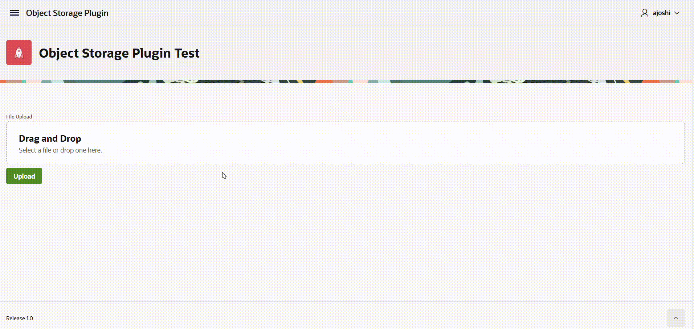
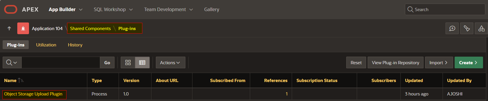
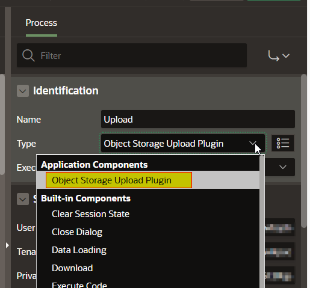
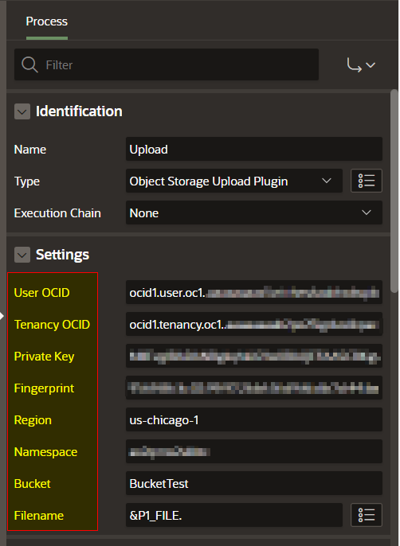

# 🗂️ APEX Object Storage Upload Plugin

**APEX Object Storage Upload Plugin** is an **Oracle APEX Process Plugin** that allows developers to **upload files directly to Oracle Cloud Infrastructure (OCI) Object Storage** — without writing a single line of code.

With a simple drag-and-drop configuration, you can browse and upload files to any OCI Object Storage Bucket of your choice, making file management within APEX applications faster, cleaner, and fully cloud-integrated.

## Demo
|  |

## 🚀 Features

* 🔹 **No Code Required** – Upload to OCI Object Storage without writing PL/SQL or REST calls.
* 🔹 **Native APEX Experience** – Works seamlessly with Oracle APEX process flows.
* 🔹 **Customizable Bucket Targeting** – Choose any Object Storage bucket dynamically or statically.
* 🔹 **Supports All File Types** – Upload any document, image, or binary file.
* 🔹 **OCI Authentication** – Inherits the standard OCI authentication method.
* 🔹 **Developer Friendly** – Simple to integrate, easy to maintain, and fully portable.

## ⚙️ How It Works

1. **Install the Plugin**

   * Import the plugin file (`APEX_Object_Storage_Upload_Plugin.sql`) into your APEX application.
   
     |  |

2. **Add to Your Process Flow**

   * In your APEX page, create a new *Process* and select **Object Storage Upload Plugin** from the list.
   
     |  |

3. **Configure Settings**

   * Provide OCI connection details such as User OCID, Tenancy OCID, Private Key, Fingerprint, Region, Namespace, Bucket Name, and the reference to the file to be uploaded.
   * Link it to your File Browse item or upload component.
   
     |  |

4. **Run and Upload!**

   * Browse your local files and upload them directly to the OCI bucket.
   * No manual code, REST APIs, or SDKs needed.

## 🧩 Example Use Case

Want to allow users to upload invoices, reports, or images to a secure OCI Object Storage location?
Simply drop in this plugin, configure it once, and you’re done — every file goes straight to your configured bucket.

## 🛠️ Requirements

* Oracle APEX 21.2 or higher
* OCI tenancy with access to Object Storage
* Target bucket

## 📦 Installation

1. Download the latest release from the [Releases](./releases) section.
2. Import the plugin into your APEX workspace using **Shared Components → Plug-ins → Import**.
3. Configure and test the upload flow.

## 🧑‍💻 Author

**Amod Joshi**

## 📄 License

This project is licensed under the **MIT License** — see the [LICENSE](./LICENSE) file for details.

